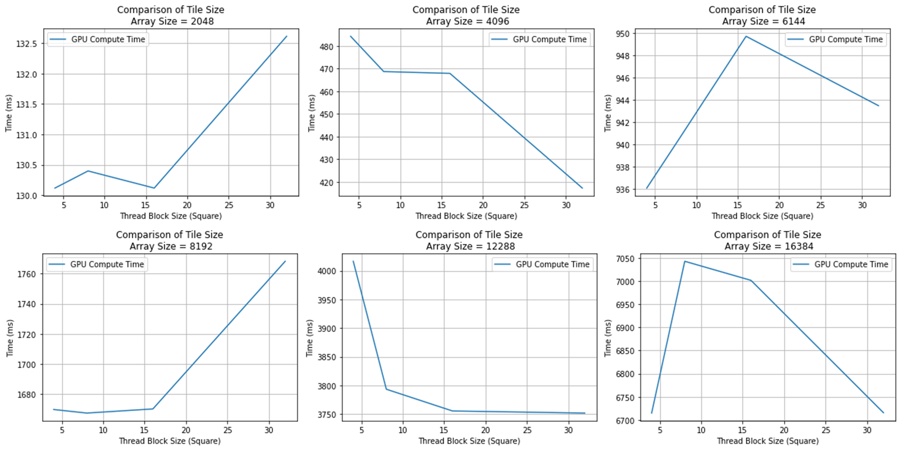
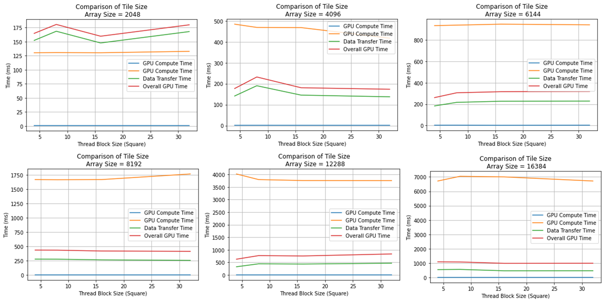

# Gaussian Blur Filter README

**Author:** Marc DeCarlo  

## Background

The Gaussian Blur Filter is a widely used image processing technique used to reduce image noise and detail by averaging the color values of nearby pixels. It is based on the Gaussian distribution, which assigns more weight to central pixels and less weight to pixels further away from the center. This blurring effect helps to smooth out images and reduce high-frequency noise.

## Introduction

The Gaussian Blur Filter problem is highly parallelizable and easily scales to leverage the large number of cores on the GPU. Each individual average filter operation is assigned to a thread to compute. Each thread is housed within a 2-D square thread block which is then stored in a 2-D execution grid that maps to the image size. The size of the thread block is a tunable parameter that will be explored in the Results section. This implementation specifically targets 2D images.

## Results

  
**Figure 1:** GPU Compute performance among different array sizes and thread block size

  
**Figure 2:** CPU, GPU compute, Data transfer time, and overall GPU time based on different Array sizes and Tile sizes

## Conclusion

Based on the results, the optimal thread block size is between 16-32. The variance in performance is most likely due to the shared nature of the machine, as it is competing with the scheduling of other threads. Despite this, there is a dramatic performance increase from CPU computation to GPU performance.

