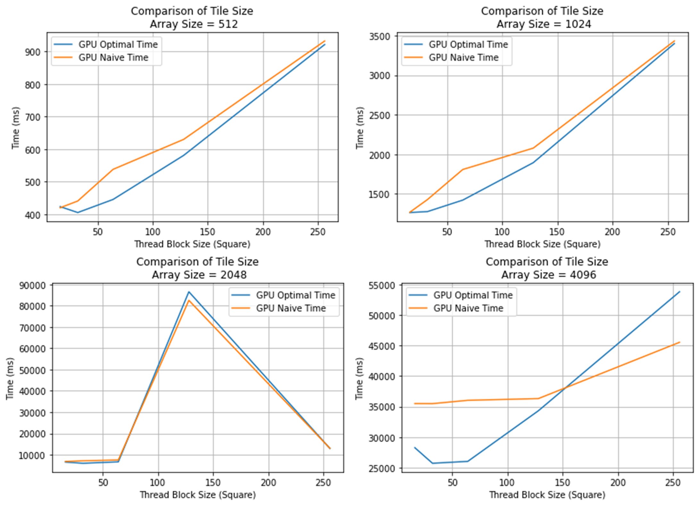
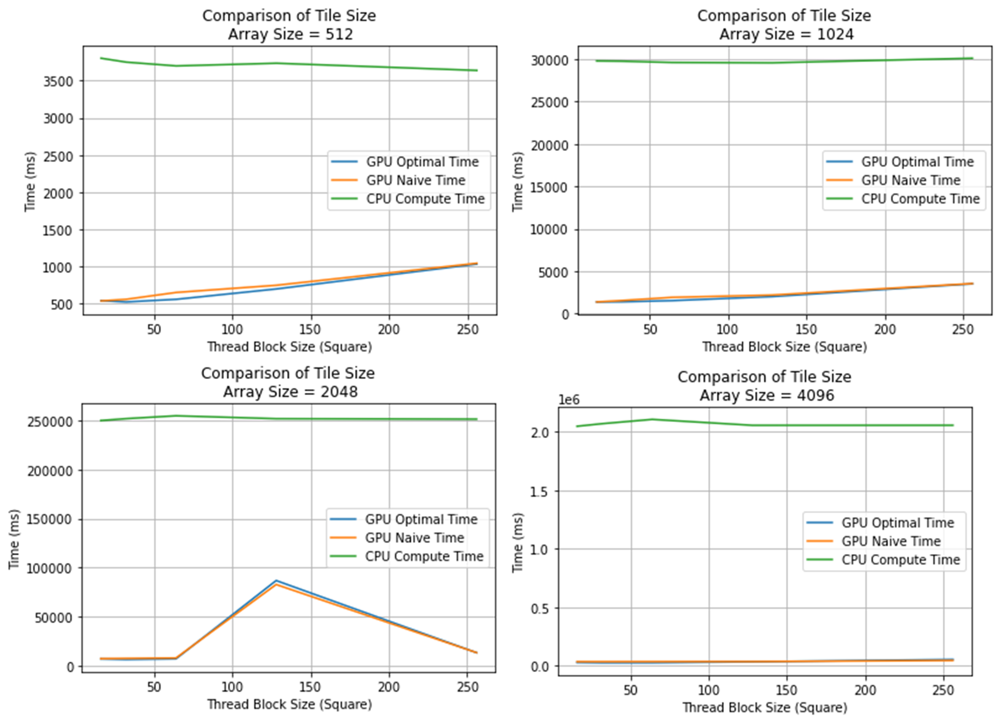

# Jacobi Iteration README

**Author:** Marc DeCarlo   

## Background

Jacobi Iteration is an iterative method for solving a linear system of equations. It is similar to Gaussian elimination but differs in that it is an iterative approximation method. The method involves repeatedly updating the values of variables until convergence is achieved. Jacobi Iteration is well-suited for parallelization, particularly on GPUs, due to its iterative nature and data-parallel characteristics.

## Introduction

The Jacobi Iteration problem solves a linear system of equations like Gaussian elimination except that it is an iterative approximation method. This problem lends itself to mass parallelization on GPUs very well. The only true performance differences on GPU implementations are in the handling of data management. Optimally using bus transactions called data coalescence is the main mechanism of data management improvement. In this problem, data coalescence can be achieved by switching the matrix from a row-major form to a column-major form.

## Results
  
**Figure 1:** Runtime differences between GPU methods differing in data coalescence.  
  
**Figure 2:** GPU implementation time vs CPU time by varying the thread block size.

## Conclusion

From these specific implementation results, it appears that a smaller thread block size leads to slightly faster performance. This phenomenon is most likely due to a smaller thread block size using more available cores and SMs than a larger thread block size. The GPU implementation was significantly faster than the CPU implementation and converged with the same Mean Squared Error in the same number of iterations.

