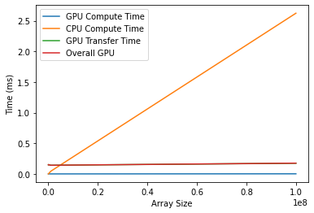
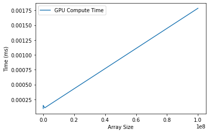

# Numerical Integration README

**Author:** Marc DeCarlo  

## Background

Numerical integration, also known as numerical quadrature, is a method of estimating the definite integral of a function by approximating it with a finite sum of weighted function values. It is widely used in various fields of science and engineering to solve problems where exact analytical solutions are difficult or impossible to obtain.

## Introduction

For this implementation of numerical integration, the thread blocks stride over the function domain and compute their respective partial sums until the next step when half the remaining threads then sum across the partial sums. This process repeats until there is a single sum. This methodology is a form of tree-style reduction. It leverages shared memory to rapidly access the sum array since the problem requires repeated accessing of the array.

## Results
  
**Figure 1:** Computation time of CPU and GPU vs input size
  
**Figure 2:** GPU computation vs input size

## Conclusion

Based on the testing, GPU acceleration dramatically decreases computation time in all cases tested. Varying thread block size was also tested, but there did not seem to be any statistically significant difference in runtime around different sizes.

