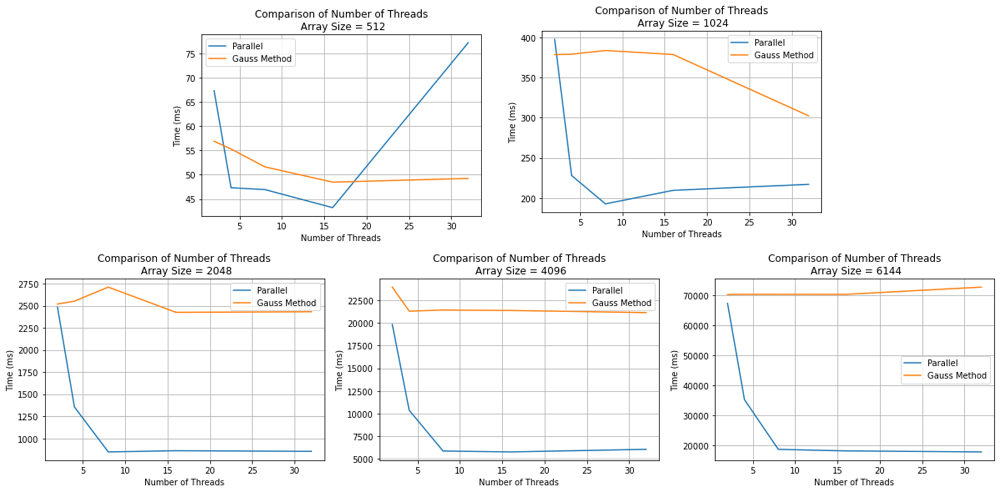

# Gaussian Elimination README

**Author:** Marc DeCarlo  

## Solution Overview

Problem decomposition revealed two areas of parallelization within the Gaussian Elimination problem. The first is row-wise scaling, and the second is column-wise elimination. The first problem is responsible for making the leading entry along the diagonal of each row equal to 1. The parallelization can occur with each worker independently scaling each element by the pivot column via an iterative chunking method. The second problem is responsible for clearing below each pivot column within the matrix. The parallelization implementation is like the first problem except it is across the column below the pivot index. The clearing of the pivot must occur after the divisionary step.

## Performance Results

  
**Figure 1:** Performance plots comparing computation time to the number of threads depending on array size.
## Reflection

There was a significant improvement across all array sizes that correlated highly with the number of threads. This makes sense since the Gaussian Elimination problem is highly parallelizable without the reliance on any locks.

