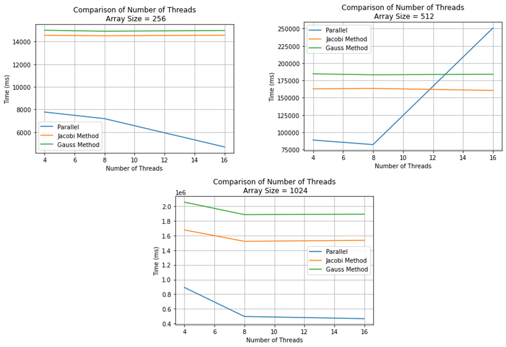

# Jacobi Heat Problem OpenMP README

**Author:** Marc DeCarlo  

## Background

The Jacobi Heat Transfer Problem is a computational simulation used to model the steady-state distribution of heat in a two-dimensional material. It involves iteratively updating the temperature values of each point in a grid based on the average of its neighboring points. This problem is widely used in various engineering and scientific fields to analyze heat conduction in materials.

## Solution Overview

The Jacobi Simulation Problem can be parallelized with OpenMP by using the reduction command and for loop collapse command. This ensures correctness instead of using locks. The rest of the implementation is like the pthreads implementation. The only real difference is the reliance on implicit barriers instead of direct barrier synchronization calls.

## Performance Results

## Reflection

Across most trials, the parallel implementation outperformed the serial version. The spike during the array of 512 was most likely due to overhead pressure from competing resources on the system, as that trend was not consistent across the other trials. OpenMP was significantly easier to implement than pthreads.

