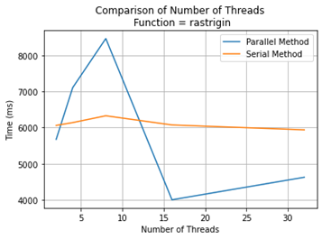
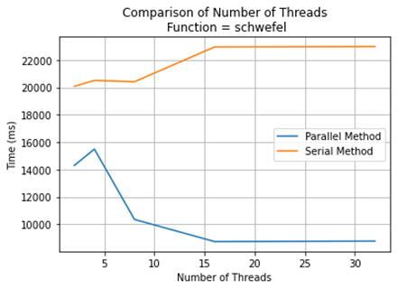

# Particle Swarm Optimization README

**Authors:**  Marc DeCarlo  

## Background

Particle Swarm Optimization (PSO) is a computational optimization technique inspired by the social behavior of birds flocking or fish schooling. In PSO, a population of candidate solutions, called particles, move through the search space and adjust their positions based on their own best known position and the global best known position of the swarm. It is commonly used in optimization problems to find the best solution to a given problem.

## Summary

In the parallel implementation of Particle Swarm Optimization, a parallel section is created surrounding the while loop to prevent the recreation of threads for each iteration, which would lead to longer run times. Each thread maintains its own copy of certain variables that are updated independently by each thread, while shared variables are appropriately synchronized using critical sections. The particle for-loop and the function for updating the best fitness are parallelized using OpenMP directives.

## Results

  
**Figure 1:** Number of threads vs runtime for the Rastrigin function.
- Parameters: 5000 iterations, 10,000 particles, 10 dimensions

  
**Figure 2:** Number of threads vs runtime for the Schwefel function.
- Parameters: 5000 iterations, 10,000 particles, 20 dimensions

## Conclusion

Particle Swarm Optimization was one of the more challenging parallel problems faced so far. It required a deep knowledge of OpenMP to reach a substantial speedup. As this is an extrema discovery problem like Gradient Descent, it is highly parallelizable, and even faster speedups can likely be achieved through the use of more resources and more efficient code.

