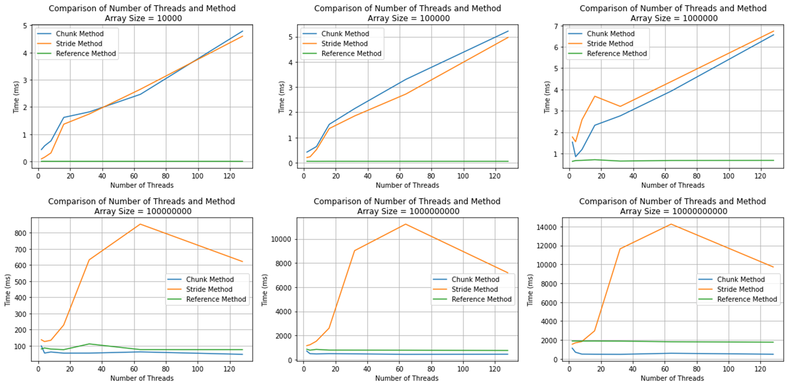

# SAXPY Problem README

**Author:** Marc DeCarlo  

## Solution Overview

The SAXPY problem involves performing the operation \( y = alpha * x + y \), where \( alpha \) is a scalar and \( x \) and \( y \) are vectors. Here, we present two parallel solutions using pthreads: the Stride Method and the Chunk Method.

### Stride Method:

In the Stride Method, worker threads iterate over the array in increments of \( k \) elements, where \( k \) is the number of threads. For example, in a two-thread solution, thread 1 handles elements 0, 2, 4, 6, etc., while thread 2 handles elements 1, 3, 5, 7, etc.

### Chunk Method:

The Chunk Method involves worker threads taking sequential sections of the parent array. In a two-thread solution, thread 1 would handle elements 0-50 while thread 2 would handle elements 51-99.

## Performance Results

The performance results are summarized in Figure 1, which plots the execution times of different solutions across various array sizes.

## Reflection

Across various trials, neither parallel implementation outperforms a serial implementation until the array sizes exceed close to 100,000,000 elements. The parallel Chunking solution proves to be the only viable parallel solution compared to the Stride Method for arrays exceeding the 100,000,000-element size. The Stride Method performs poorly due to an increased rate of cache misses and false sharing, especially as the quantity of threads increases.

In comparison, the Chunk Method avoids most of these cache misses by exploiting the locality of the elements stored in the array. Despite the "embarrassingly" parallel nature of the problem, the reference serial method performs well due to the efficiency of modern-day compilers at extracting inherent parallelism.
