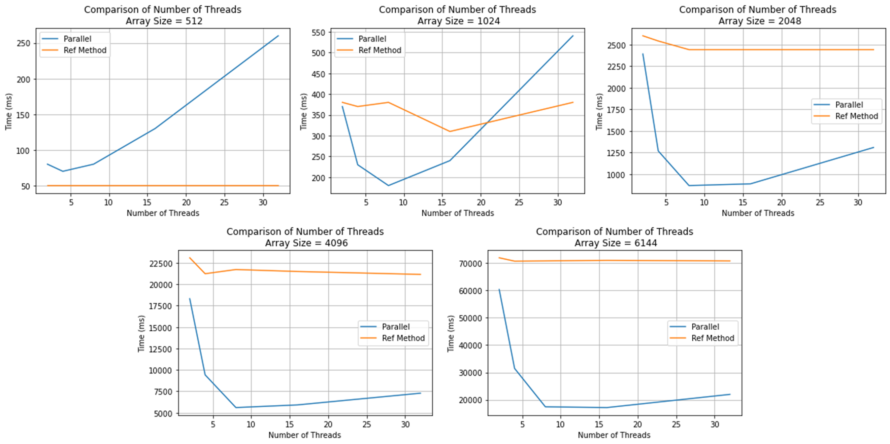

# Gaussian Elimination README

**Author:** Marc DeCarlo   

## Background

Gaussian Elimination is a fundamental algorithm used to solve systems of linear equations. It is named after the German mathematician Carl Friedrich Gauss. The method works by transforming the system of equations into row-echelon form through a series of elementary row operations, such as row scaling and row addition/subtraction. Once the system is in row-echelon form, it becomes easy to solve for the variables using back-substitution.

## Solution Overview

Problem decomposition revealed two areas of parallelization within the Gaussian Elimination problem. The first is row-wise scaling, and the second is column-wise elimination. The first problem is responsible for making the leading entry along the diagonal of each row equal to 1. The parallelization can occur with each worker independently scaling each element by the pivot column via an iterative chunking method. The second problem is responsible for clearing below each pivot column within the matrix. The parallelization implementation is like the first problem except it is across the column below the pivot index. The clearing of the pivot must occur after the divisionary step.

## Performance Results

## Reflection

This parallel code implementation begins to beat serial code somewhere between an array size of 512 and 1024. Even in the 1024 case, parallel only outperforms serial with a minimal number of threads. The main drawback of this parallel implementation besides the edge cases of false sharing is the necessity of barrier synchronization points between each iteration and between the two subproblems. This returns the otherwise highly parallel code to serial, which severely limits the speedup.
The goal of future parallel code implementations should be to minimize the barrier synchronization points.
