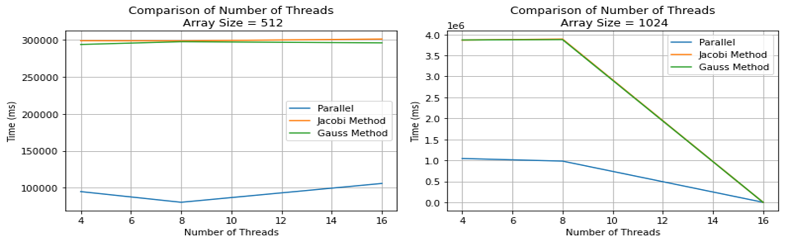

# Jacobi Heat Transfer Problem README

**Author:** Marc DeCarlo  

## Problem Description

The Jacobi Heat Transfer Problem is a computational simulation used to model the steady-state distribution of heat in a two-dimensional material. It involves iteratively updating the temperature values of each point in a grid based on the average of its neighboring points. This problem is widely used in various engineering and scientific fields to analyze heat conduction in materials.

## Solution Overview

The Jacobi Simulation Problem can be parallelized by chunking the array and independently computing partial difference sums between the old state and new state. Once shared variables are initialized holding the total difference between the two states, each worker thread can compute partial differences among their chunk and add them to the shared variable via a mutex.

## Performance Results

## Reflection

This problem saw significant speedup across all array sizes as most of the computational work is done during traversal and local computation in the array. All actions are independent of each other, which means that it is highly parallelizable. With that being said, the mutex and barrier synchronization points do hinder parallel performance, but that is mitigated by giving each thread similar workloads, thus minimizing the amount of time hung at barrier synchronization points. The critical section is a relatively small hindrance since most of the computation time is spent in the unblocked array.
